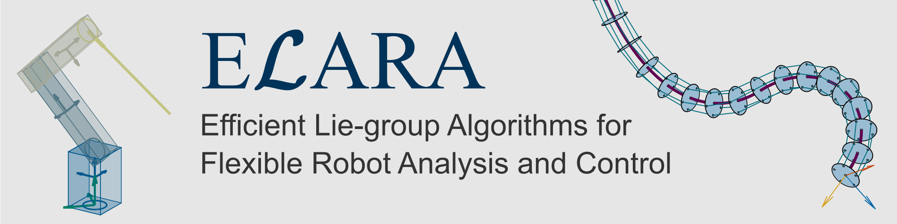

<div align="center">
  
</div>

[](https://www.mathworks.com/matlabcentral/fileexchange/183990-elara-flexible-robot-simulation-and-control-toolbox)
[](https://matlab.mathworks.com/)

[](LICENSE)


# ELARA Simulation and Optimal Control Toolbox

ELARA, short for **Efficient Lie-group Algorithms for Flexible Robotic Analysis and Control**, is a MATLAB toolbox for the simulation and optimal control of robotic (multibody) systems consisting of rigid and highly flexible links.
It combines Lie-group kinematics on SE(3), rigid multibody dynamics, geometrically exact beam models, structure-preserving variational integration, and CasADi-based direct optimal control.

## Features

- Supports general rigid-flexible multibody models with open kinematics consisting of rigid links, flexible beam links, and screw joints (i.e., revolute, prismatic, or screw joints)
- Actuation via actuated screw joints or tendon actuation for continuum manipulators
- Fullly analytic kinematics and differential kinematics on SE(3), including forward kinematics, geometric Jacobians, and derivative of Jacobians
- Time integration with highly efficient Lie-group variational integrator or any standard ODE solver via general interface (including all MATLAB ODE solvers)
- Fully CasADi-compatible implementation, e.g., for optimal control, parameter identification, or system optimization
- Direct optimal control with various time discretizations, including variational, Runge-Kutta (2nd and 4th order), and implicit-midpoint discretizations
- Extensive plotting, visualization, and animation functionality
- Numerical implementation that is optimized for C/C++ code generation, both for MEX generation (optional, but recommended) for increased performance, and to generate C/C++ code for on-line control implementations

## Requirements

- MATLAB `R2024b` and above

Optional dependencies:

- CasADi for MATLAB: required for optimal control or other optimization-related tasks (tested with `3.7.2`)
- MATLAB Coder and C++ compiler for optional MEX generation

### Toolbox installation
- Option 1 (recommended): Installation via the MATLAB Add-On explorer. Simply search for "ELARA" in the MATLAB Add-On explorer and install! Alternatively, you can install it via the [MATLAB File Exchange](https://www.mathworks.com/matlabcentral/fileexchange/183990-elara-flexible-robot-simulation-and-control-toolbox).
- Option 2: Installation via the packaged toolbox file. Download the toolbox file `elara-toolbox.mltbx` from the release page, then double-click on it or run `matlab.addons.install("elara-toolbox.mltbx")`.
- Option 3: Clone the repository locally and add the folder `elara-toolbox` (including subfolders) to your MATLAB path.

### Optional components
- For optimal control, install CasADi from <https://web.casadi.org/> and add it to the MATLAB path
- For code generation (to generate MEX files), install a compatible C++ compiler and setup MATLAB Coder using `mex -setup C++`

### Verify installation and compile MEX functions
1. In the MATLAB console, run `elara.setup` to validate the installation of the toolbox and the optional components. The command displays, whether all components are installed correctly.
2. If you have MATLAB Coder and a compatible C++ compiler installed, run `elara.build`, which will compile all required MEX files. The compiled files are stored in the `/build` directory.
3. You can again run `elara.setup` to verify that the MEX files are available on the path. The toolbox will now automatically use the compiled functions instead of the slower MATLAB functions.

## Quick Start
A quick start guide is available under `doc/QuickStart.mlx`, explaining the installation steps and core functionality.

### Examples
The toolbox includes several examples for the simulation and optimal control of mechanical systems available in the `examples` folder.
The simulation examples demonstrate the standard workflow to simulate the dynamical behavior of mechanical systems:

1. Define the system's links using `MBLinkDefinition` objects.
2. Create an `MBSimulation` object that stores the system definition and all simulation parameters.
3. Set `MBSim.simPars` for initial conditions, inputs, gravity, and final time.
4. Select a solver such as `MBSimIntegratorVarIntBroyden` or `MBSimIntegratorODEDirect`.
5. Run `simulateSystem`, then use plotting or animation helpers for post-processing.

The optimal-control examples demonstrate:

1. Creating an `elara.ocp.Problem`.
2. Using `MBSystemSym(links)` for CasADi-compatible dynamics.
3. Selecting an OCP discretization such as `elara.ocp.IntegratorVI` or `elara.ocp.IntegratorRK`.
4. Initializing the NLP solver with `initSolver`.
5. Solving with `solve` and post-processing the resulting trajectory.

## Core Concepts

### System Definition

ELARA systems are built from arrays of `MBLinkDefinition` objects:

- `MBLinkDefinitionRigid` stores rigid-link mass, inertia, joint data, reference transformations, and optional visualization data.
- `MBLinkDefinitionFlexible` stores beam length, segment count, deformation-mode selection matrices, reference strains, beam parameters, optional attached masses, and optional cable actuation.
- `MBBeamParams` stores beam geometry, material data, stiffness, mass, inertia, and damping.

The assembled system object is either:

- `MBSystemNum`, used for numeric forward simulation, or
- `MBSystemSym`, used for CasADi-compatible symbolic dynamics in optimal control.

### Simulation

`MBSimulation` combines a link definition, assembled numeric system, simulation parameters, solver, and result object. Initial conditions, inputs, gravity, external wrenches, and final time are stored in `MBSimPars`.

Moreover, it stores the selected solver (numerical integrator) along with all required solver settings.

After simulation, use `plotAll`, `computeEnergies`, `drawSnapshots`, and `animateSimResults` for post-processing.

#### Numerical Integrators

Currently, the following integrators are implemented:

- `MBSimIntegratorVarIntBroyden`: Lie-group variational integrator with fixed step size `h`.
- `MBSimIntegratorODEDirect`: MATLAB `ode` object interface.
- `MBSimIntegratorODEDirectFunctionBased`: function-handle interface for solvers such as `ode45()`.

For numerically stiff systems, use an appropriate stiff solver, e.g., the variatonal integrator, or ODE solvers for stiff systems such as `ode15s`, `ode23t`, or `CVODE-S`.
See the MATLAB documentation for details on the ODE solvers and the solver settings.

#### Using the Lie-Group Variational integrator

With `MBSimIntegratorVarIntBroyden`, an implementation of an implicit, fixed-step, first/second-order Lie-group variational integrator is available that can be highly efficient both for numerically non-stiff and   stiff systems.
The integrator uses Broyden's good method to solve the implicit system of equations in each time step.

- The primary solver setting is the time step `h`, which determines both the accuracy (integration error) and the computation time of the integrator.

   __Important:__ For numerically stiff systems, there is usually a _maximum time step_ $h_{max}$, which can not be exceeded for the solver to run successfully. For larger time steps $h > h_{max}$, the implicit solver will not converge, and the simulation will fail. 
   
   - Hence, if the variational integrator does not run for a specific system, the first thing to try is usually decreasing the time step, e.g., by factors of 2 or 10.
   
   - The maximum time step strongly depends on the dissipation in the system; with increased dissipation, larger time steps can be used.
   
- For systems with dissipation, the property `aTrapez` determines the integrator's order: For `aTrapez = 0.5`, it is second-order, for `aTrapez = 0`, it is first-order.
  For conservative systems (without dissipation), this value has no effect, since it only affects the dissipation terms.
  
  For increased accuracy, one usually wants to use `aTrapez = 0.5` for second-order accuracy. However, in cases where computational efficiency is the primary concern, `aTrapez = 0` may be useful,
  since it usually results in a much higher maximum time step $h_{max}$ (i.e., much larger time steps can be used, which decreases computation time), and the solver becomes generally more robust.
  
- The integrator setting `errorMargin` determines the residual threshold for the solution of the implicit system of equations.
  Adjusting this value is often advantageous for either increased numerical efficiency (since higher tolerances usually mean less solver iterations and thus less computation time), or increased robustness.
  In some cases, adjusting this value may allow the solver to run successfully when it failed for the default settings.
  However, it depends on the specific system, which values result in the highest stability.
  
  Common values are between `1e-7` and `1e-12`.
  
  
- For the highest performance and stability, one can additionally tune the parameters `errorMarginLimit`, `maxIterations` and `JacobianIterationThreshold`.
  
  - If `errorMarginLimit` is set to a different (larger) value than `errorMargin`, the integrator does not abort the simulation if the implicit solver does not converge to the default tolerance specified by `errorMargin` within `maxIterations`, as long as the residual remains below `errorMarginLimit`.
  
    This setting can be useful to successfully integrate systems with "challenging" numerical properties, but usually results in much larger run times since the solver executes a large number of additional iterations.
    
  - Correspondingly, `maxIterations` sets the maximum number of iterations of the implicit solver. If the residual does not converge to `errorMarginLimit` within this number, the integration fails.
  
  - `JacobianIterationThreshold`: This setting defines how often the Jacobian of the implicit system of equations (i.e., the DEL Jacobian) is recomputed during integration.
   To increase performance, the Jacobian is not computed in each time step; it is only recomputed if the nr. of iterations in the last time step exceeds `JacobianIterationThreshold`.
   Otherwise, the Jacobian of the last time step is reused.
   Reusing the old Jacobian is a compromise between the computational cost of recomputing the exact Jacobian (which is expensive) and a few additional solver iterations caused by a slightly inaccarute Jacobian.
   There is usually a optimal value to achieve the highest perfomance, which usually lies between 3 and 5.
   In some cases, this mechanism can impact the stability of the integrator, and using a smaller number (or even 0 to disable the feature) may help.


#### Practical Quick-Start Guide for the Variational integrator

1. If the system is dissipative, decide whether the focus is on accuracy (low integration error), or on computational time. For accuracy, choose `aTrapez = 0.5`, otherwise `aTrapez = 0`.
   For conservative (non-dissipative) systems, skip this step, as this setting only influences the dissipation term.

2. Start with a fairly large time step `h`, e.g., the default value. If the integration does not succeed or the results show signs of instability (which may be the case for numerically stiff systems), decrease `h` until the integration completes successfully.
Otherwise, choose `h` according to the requirements on integration error and run time.

3. For highest performance, adjust `errorMargin`, which may allow to run the simulation with a larger time step or a smaller number of iterations, resulting in faster run times.

4. For complex cases, you can further adjust `errorMarginLimit` and the other settings mentioned above.


### Optimal Control

`elara.ocp.Problem` stores the time grid, boundary conditions, state and input bounds, cost weights, TCP targets or trajectories, optional B-spline input parameterization, and CasADi/Ipopt options.

Available OCP discretizations include:

- `elara.ocp.IntegratorVI`: First/second-order variational/discrete Euler-Lagrange transcription (DMOC)
- `elara.ocp.IntegratorRK`: Second-/fourth-order ODE transcription with explicit Runge-Kutta integration (`RK2` and `RK4`)
- `elara.ocp.IntegratorImplicitMidpoint`: Second-order ODE transcription with implicit midpoint rule

The helper `elara.ocp.computeInitialGuessInvDyn` can generate inverse-dynamics-based initial guesses for trajectory-optimization problems.


## Citation

If you use the Elara toolbox in your research, please cite the following papers:

**BibTeX:**

```bibtex
@article{HK24,
  title = {Relative-Kinematic Formulation of Geometrically Exact Beam Dynamics Based on {{Lie}} Group Variational Integrators},
  author = {Herrmann, Maximilian and Kotyczka, Paul},
  year = 2024,
  month = dec,
  journal = {Computer Methods in Applied Mechanics and Engineering},
  volume = {432},
  pages = {117367},
  issn = {00457825},
  doi = {10.1016/j.cma.2024.117367},
}
@inproceedings{HPK26,
  title = {Discrete {{Geometric Modeling}} and {{Extended State Estimation}} of {{Continuum Robots}}},
  booktitle = {IFAC World Congress},
  author = {Herrmann, Maximilian and Pfeiffer, Leander and Kotyczka, Paul},
  year = 2026,
  address = {Busan},
  }
```

**APA:**

> Herrmann, M., & Kotyczka, P. (2024). Relative-kinematic formulation of geometrically exact beam dynamics based on Lie group variational integrators. Computer Methods in Applied Mechanics and Engineering, 432, 117367. https://doi.org/10.1016/j.cma.2024.117367

> Herrmann, M., Pfeiffer, L., & Kotyczka, P. (2026). Discrete Geometric Modeling and Extended State Estimation of Continuum Robots. IFAC World Congress.

## License

This project is licensed under the MIT License - see [LICENSE](LICENSE) file for details.

## Authors

- Maximilian Herrmann (TUM, Chair of Automatic Control)
- Leander Pfeiffer (TUM, Chair of Automatic Control)

The core toolbox was developed by Maximilian Herrmann. Leander Pfeiffer provided helpful input and contributions in the final development stages.
Moreover, Philipp Tarbiat, Tobias Farger, and Akash Cheriath contributed helpful input and code snippets during their student projects at the chair.
These contributions are marked in the comments.

## Developer documentation

For release, the toolbox is packaged with the script `packageToolbox.m`, which creates the corresponding `mltbx` file.
The version number in the script must be incremented manually.

## Contact & Support

For questions, issues, or feature requests:

- Open an issue on GitHub
- Contact: [maximilian.herrmann@tum.de, leander.pfeiffer@tum.de]
